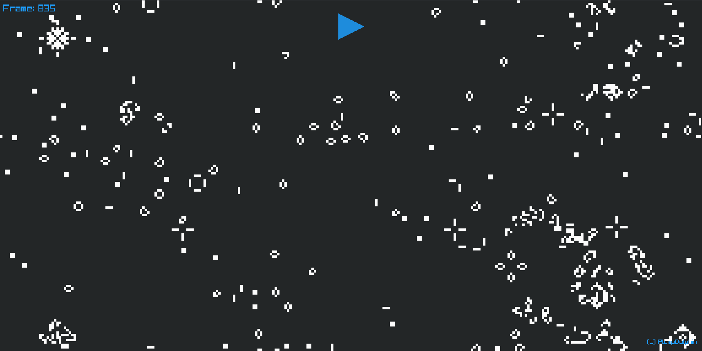

<div align="center">
    
    <h1>Ray of Life</h1>
</div>


This is a basic example program, built with Raylib, that plays a randomized Conway's Game of Life! No fancy bells or whistles, just mesmerizing, procedurally-generated visuals to view for hours on end.

## Building
> **_WARNING:_**  The build script is written for Linux systems. Windows compilation may vary.

In order to build this yourself, all you need to do is to clone the repository (or downlaod and unzip) then run the following command:

```shell
./build.sh
```

There is also an optional compilation flag `-DBORDERLESS` which makes the application run in borderless fullscreen.
To build with this flag, just append to the call of the build script:
```shell
./build.sh -DBORDERLESS
```

And that's all there is to it!

## Notes:
The rendering process is currently poorly optimized and may cause trouble on laptops and low-end graphics cards. This is because all cells are rendered with separate draw calls, leading to exponentially higher performance hit with increased resolution.

This can be fixed by implementing a shader to render the cell data instead of the CPU passing draw calls one-at-a-time. Similarly, cell rule computation could be implemented as a compute shader for even more performance improvements!

<div align="center">
    <h3>Hope you enjoy!</h1>
</div>